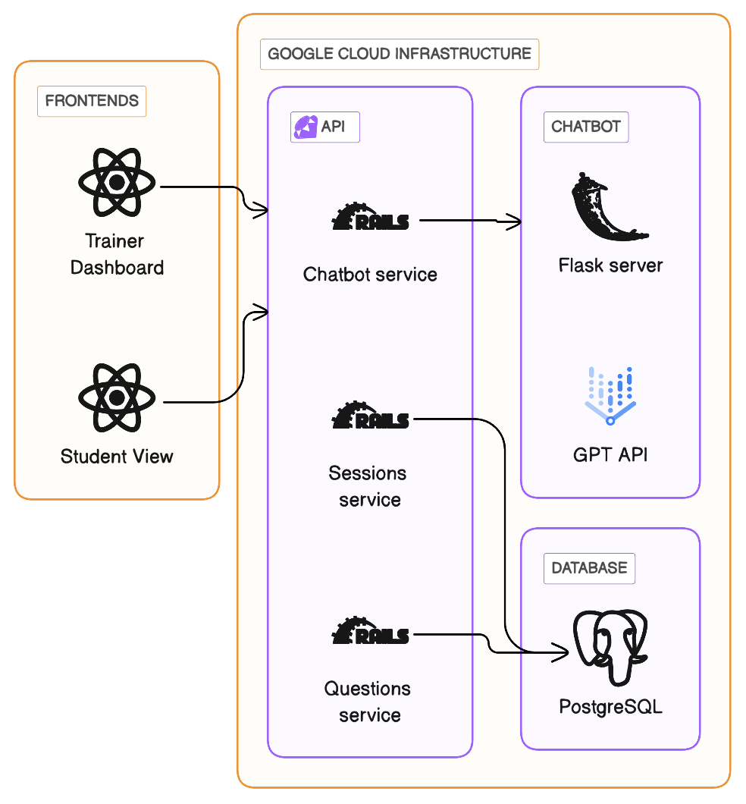

# Team Innovate: Interfaith.ai

This project is a collaboration between SDS Team 5 (Innovate), Being Bridges, and Google, as part of SUTD Service Design Studio 2023 Fall Term.

## Team Members

## Problem Statement

As a trainer, currently, I have to spend excessive time and effort addressing learner’s repetitive knowledge-based questions in order to move on to skill-based learning.

As a learner, currently, I have to wait till the actual training day in order to ask any questions I may have in order to build enough confidence to move on to skill-based learning.

## Solution & Features

Our solution takes on a two-pronged approach:

1. A by-session FAQ that allows trainers to curate a set of commonly asked questions and answers for students to refer to.
2. An inter-faith focused chatbot that allows students to get quick answers to their questions.

## Relevant Links

- [Design Workbook](https://docs.google.com/document/d/1LR0aVwFEC9dLEMoq9hmdrQsxLnjTaPAAVcX__730-FM/edit?usp=sharing)
- [Figma](/)
- [Google Site](/)
- [Student Frontend](https://yes-v6tbj6dv6a-as.a.run.app)
- [Trainer Frontend](https://e-blyqvsvnka-as.a.run.app)

## Architecture & Design

## Installation and Setup

### Backend

#### Prerequisites

1. Make sure Ruby is installed. You can run `ruby --version` to check if you have an appropriate version installed. Currently, I'm using 2.7.8
2. Bundler. Check bundler is installed by `bundler -v`. I'm using 2.1.4
3. Postgres should be installed. `postgres -V`
4. Rails. `rails -v`. I'm using 7.0.2.2

#### Setting up

1. Clone the repo and cd into this directory
2. Install the required gems. `bundle install`
3. go to config and create the file `master.key` and get the master key
4. Set up the database, load the schemas and seed the database. `bundle e rails db:setup`
5. Run `bundle e rails db:migrate` if there are necessary migrations
6. `rails server` to start the server

### Frontend

### Prerequisites

- Node.js
- Yarn

#### Trainer frontend

##### Installation

1. `cd` into the `trainer-frontend` directory
2. Run `yarn install` to install dependencies
3. Populate the `.env` files with the required environment variables
4. Run `yarn start` to start the development server

#### Student frontend

##### Installation

1. `cd` into the `trainer-frontend` directory
2. Run `yarn install` to install dependencies
3. Populate the `.env` files with the required environment variables
4. Run `yarn start` to start the development server

### Chat API

Uses flask. Make sure Python is installed.

#### Installation

1. `cd` into the `chatbot` directory
2. `pip install -r requirements.txt`
3. `python main.py`

## Testing

We have various tests for our frontend and backend.

### Backend

Our Rails application is tested using MiniTest, comprising unit and integration tests.

To run the tests, run `rails test` in the `faqapi` directory.

To view the test coverage, run `open coverage/index.html` in the `faqapi` directory (using SimpleCov)

### Frontend

Uses Cypress for component-level unit testing.

To run the tests, run `yarn cypress` in the `trainer-frontend` directory.

### Chat API

Run `pytest` in the `chatbot` directory.

### End-to-end

Using Cucumber and Selenium for end-to-end, user acceptance testing.

All our tests and stored in the 'tests' directory.

View all our features at `tests/features`.

1. cd into the `tests` directory
2. Run `yarn` to install dependencies
3. Run `yarn cucumber` to run the tests, or `yarn cucumber --tags @tagname` to run tests with a specific tag
